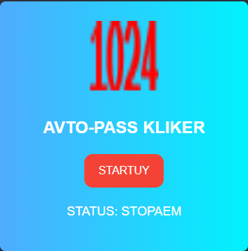

# Расширение AVTO-PASS KLIKER для Chrome

Это расширение для Chrome автоматизирует процесс нажатия кнопки "Pass" на сайте Bridge Base Online (BBO), платформе для игры в бридж онлайн.

## Установка

Чтобы установить расширение AVTO-PASS KLIKER:

1. **Клонировать репозиторий:**
```bash
git clone https://github.com/Sirnilin/auto-pass-bridgebase.git
```
2. **Загрузить расширение:**
- Откройте браузер и перейдите по адресу `chrome://extensions/`.
- Включите режим разработчика (переключатель обычно находится в правом верхнем углу).
- Нажмите на кнопку "Загрузить распакованное расширение" и выберите папку, куда вы клонировали репозиторий.

3. **Установка завершена:**
- Расширение AVTO-PASS KLIKER должно появиться в списке установленных расширений в Chrome.

## Использование

1. **Перейдите на сайт Bridge Base Online (BBO):**
- Зайдите на [Bridge Base Online](https://www.bridgebase.com) и войдите в свою учетную запись.

2. **Активируйте расширение:**
- Нажмите на иконку AVTO-PASS KLIKER в панели инструментов Chrome.

3. **Управление автоматическим проходом:**
- Нажмите кнопку "STARTUY", чтобы начать автоматическое нажатие кнопки "Pass".
- Нажмите кнопку "STOPAY", чтобы остановить автоматическое нажатие.

4. **Отображение статуса:**
- Интерфейс расширения показывает текущий статус: "STATUS: KLIKAEM" (кликаем) или "STATUS: STOPAEM" (не кликаем).

## Скриншоты



